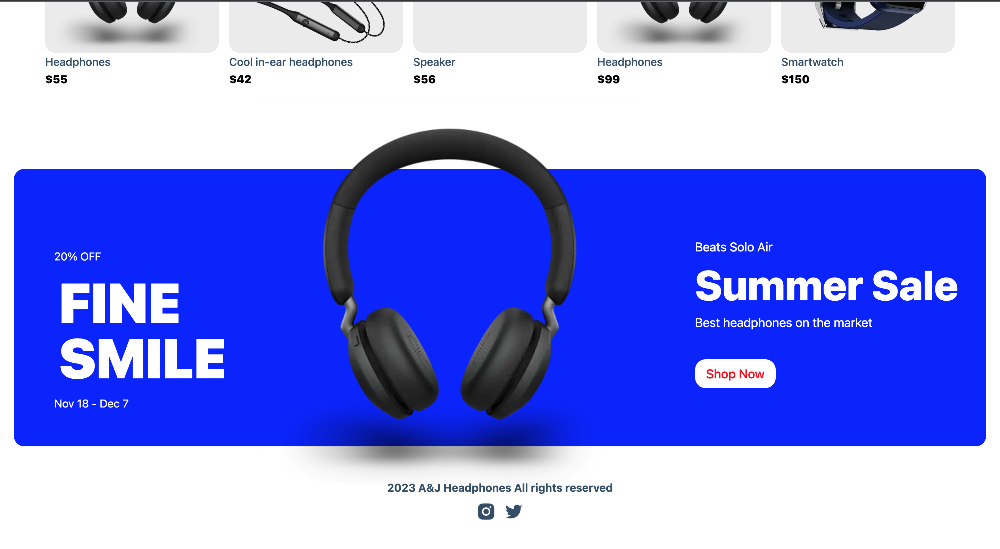

This is a [Next.js](https://nextjs.org/) project bootstrapped with [`create-next-app`](https://github.com/vercel/next.js/tree/canary/packages/create-next-app).

## Getting Started
## Ecommerce Website

First, run the development server:

1. Cloning

   Open your Terminal and copy the command below:
   ```bash
   clone https://github.com/Goldelm24/ecommerce-stripe-sanity.git
   ```
2. Navigate to the project directory: After the repository is cloned, navigate to the project directory using the following command:
   ```bash
   cd ecommerce-stripe-sanity
   
3. Install dependencies: Once you’re inside the project directory, run the following command to install the dependencies required for the  project:
   ```bash
   npm install

<!-- ABOUT THE PROJECT -->
## About The Project



Demo preview. 

Libraries/frameworks used for this project:

 <br/>
<br/>
 <br/>
 <br /> 

##Deployment
The easiest way to deploy a  <br/>
is by using 

Check out [Next.js deployment documentation](https://nextjs.org/docs/deployment) for more details about hosting and deployment. 
Connect with me on 
